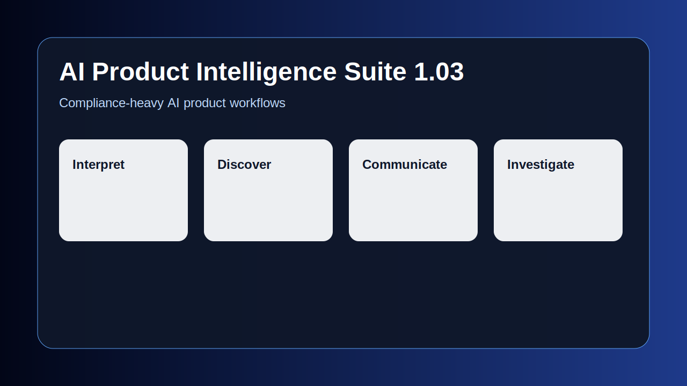
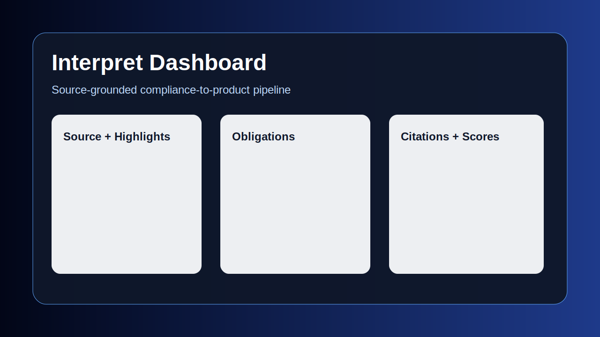
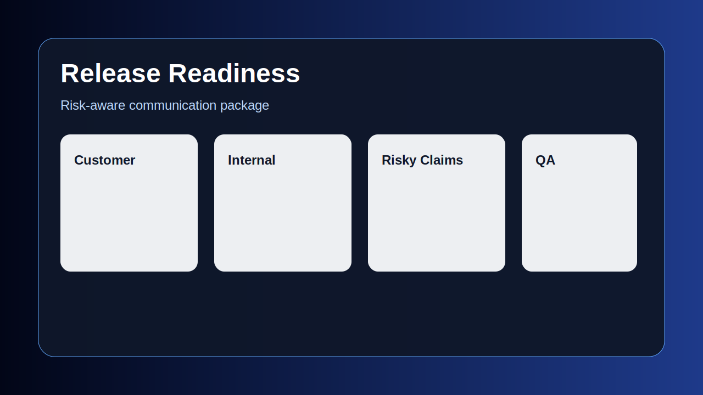
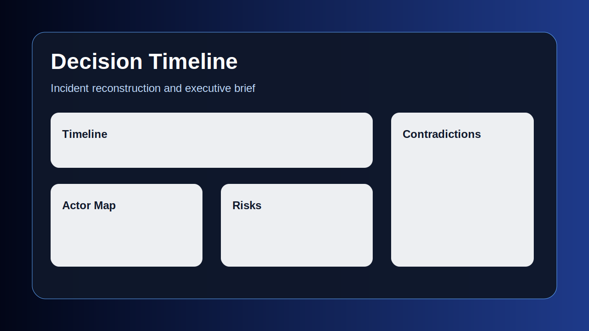

# AI Product Intelligence Suite 1.04


**This project is a portfolio case study, not a commercial product.**

It demonstrates how I design AI product workflows for regulated enterprise software:

1. domain understanding;
2. AI workflow design;
3. human-in-the-loop review;
4. risk-aware communication;
5. evaluation discipline;
6. enterprise readiness judgment;
7. product strategy.

The goal is to demonstrate product judgment, workflow design, evaluation thinking and hands-on execution — not to claim that a local Streamlit prototype is a production enterprise platform.

> Positioning: **I design AI product workflows that turn ambiguous compliance inputs into auditable product decisions.**

## Review the portfolio

If you are reviewing this project for hiring, start here:

- [`PORTFOLIO_REVIEW_GUIDE.md`](PORTFOLIO_REVIEW_GUIDE.md) — 5-minute, 15-minute and 45-minute review paths.
- [`WHAT_THIS_DEMONSTRATES.md`](WHAT_THIS_DEMONSTRATES.md) — skills-to-evidence map.
- [`HERO_CASE_STUDY.md`](HERO_CASE_STUDY.md) — short hero case summary.
- [`docs/HERO_SAF_T_EINVOICING_CASE.md`](docs/HERO_SAF_T_EINVOICING_CASE.md) — deep SAF-T PT / e-invoicing walkthrough.
- [`docs/ERROR_TAXONOMY_FAILURE_MODES.md`](docs/ERROR_TAXONOMY_FAILURE_MODES.md) — formal error taxonomy, failure cases and trade-off analysis.
- [`docs/NEGATIVE_TEST_COVERAGE_POLICY.md`](docs/NEGATIVE_TEST_COVERAGE_POLICY.md) — mandatory negative QA coverage gate.
- [`docs/REAL_USAGE_METRICS_AND_DATA_PORTABILITY.md`](docs/REAL_USAGE_METRICS_AND_DATA_PORTABILITY.md) — real usage metrics, import/export and data portability.
- [`PRODUCT_STRATEGY.md`](PRODUCT_STRATEGY.md) — ICP, personas, buyer, wedge, adoption path, pricing hypothesis, roadmap and metrics.
- [`INTERVIEW_TALKING_POINTS.md`](INTERVIEW_TALKING_POINTS.md) — concise explanations for interviews.
- [`DEMO_WALKTHROUGH_FOR_HIRING.md`](DEMO_WALKTHROUGH_FOR_HIRING.md) — 90-second hiring walkthrough.
- [`docs/UI_UX_REVIEW.md`](docs/UI_UX_REVIEW.md) — guided demo UX strategy.
- [`docs/UI_UX_POLISH_V22.md`](docs/UI_UX_POLISH_V22.md) — visual hierarchy, density reduction and timeline polish.
- [`docs/CLAIM_HYGIENE_AUDIT.md`](docs/CLAIM_HYGIENE_AUDIT.md) — skeptical-reviewer audit for overclaims, synthetic metrics and real/local boundaries.
- [`docs/AUTO_SCORE_TO_CLAIM_SCANNER_STORY.md`](docs/AUTO_SCORE_TO_CLAIM_SCANNER_STORY.md) — how self-score risk became an automated claim-hygiene scanner.
- [`docs/CITATION_VERIFIER_VALIDATION_STUDY.md`](docs/CITATION_VERIFIER_VALIDATION_STUDY.md) — validation pack for comparing the citation verifier against human labels.
- [`docs/CITATION_VERIFIER_ERROR_ANALYSIS.md`](docs/CITATION_VERIFIER_ERROR_ANALYSIS.md) — component-level error analysis for the citation verifier.
- [`docs/SWISS_QR_BILL_SECOND_DOMAIN_CASE.md`](docs/SWISS_QR_BILL_SECOND_DOMAIN_CASE.md) — second-domain generalization check beyond SAF-T.
- [`docs/COMPANION_PLAYBOOKS.md`](docs/COMPANION_PLAYBOOKS.md) — companion artifacts kept separate from the Streamlit app to preserve scope discipline.
- [`docs/AI_PAYMENTS_COMPLIANCE_MIT_COURSE_COMPANION.md`](docs/AI_PAYMENTS_COMPLIANCE_MIT_COURSE_COMPANION.md) — payments / ISO 20022 course companion for the MIT agentic AI playbook.
- [`docs/STALENESS_AND_LINEAGE_POLICY.md`](docs/STALENESS_AND_LINEAGE_POLICY.md) — downstream impact and stale artefact policy.
- [`REAL_USAGE_EVIDENCE_REPORT.md`](REAL_USAGE_EVIDENCE_REPORT.md) — generated/placeholder report for accumulated usage evidence.

## Hero workflow

The core case is **SAF-T PT / e-invoicing compliance-to-product traceability**:

```text
input document
→ extracted obligations
→ reviewer corrections
→ before/after requirement
→ Jira-style ticket
→ QA case
→ risky release note
→ safer release note
→ incident if missed
→ final audit report
```

This is intentionally deeper than a typical demo output. It shows how one compliance-sensitive input can propagate through product, QA, release communication and incident learning.

## Companion domain for MIT course

1.04 adds a **companion playbook**, not a new app module: **AI Payments Compliance Assistant — SEPA / ISO 20022 structured addresses**.

It is included because it supports a separate MIT Sloan course project on implementing agentic AI and demonstrates a third regulated domain beyond SAF-T and Swiss QR-Bill. It is deliberately kept outside the core Streamlit workflow to preserve scope discipline.

Start here:

- [`docs/COMPANION_PLAYBOOKS.md`](docs/COMPANION_PLAYBOOKS.md)
- [`docs/AI_PAYMENTS_COMPLIANCE_MIT_COURSE_COMPANION.md`](docs/AI_PAYMENTS_COMPLIANCE_MIT_COURSE_COMPANION.md)
- [`companion_playbooks/ai_payments_compliance/README.md`](companion_playbooks/ai_payments_compliance/README.md)

## Why this matters

Compliance-heavy enterprise teams often struggle with:

- slow regulatory discovery cycles;
- inconsistent translation from compliance text to product requirements;
- weak traceability between sources, rules, tests and release notes;
- risky customer-facing wording;
- poor incident timelines and decision audit trails.

This portfolio project turns those problems into an AI-assisted workflow with explicit review, evidence, quality checks and limitations.


## What changed in 1.04

1.04 is a small publication-focused update. It does **not** add another Streamlit module.

- Added an AI Payments Compliance Assistant companion playbook for the MIT Sloan agentic AI course.
- Added SEPA / ISO 20022 structured-addresses as a third regulated domain, alongside SAF-T and Swiss QR-Bill.
- Kept the payments playbook separate from the app to preserve scope discipline.
- Added sample payments input and expected-output scaffolding for a future separate low-code/agentic project.
- Added `RELEASE_1_02.md`.

## What changed in 1.01

1.01 is deliberately focused on architecture, learning-loop evidence and first-click UX:

- `core/pipeline.py` makes the Interpret → Review → Discover flow declarative and testable.
- `services/human_feedback_service.py` stores reviewer decisions in a dedicated `human_reviews` table.
- Prior reviewer corrections can be reused as local few-shot examples/pattern guardrails in future runs.
- The guided demo is the default portfolio path and now uses an 8-step progress indicator.
- Additional unit tests cover the core pipeline, citation verifier, QA coverage and negative test gate.

## What changed in v24

v24 is intentionally small and validation-focused. It does **not** add another broad product module. It strengthens the portfolio in five ways:

- **Version-source discipline:** `APP_VERSION` / `APP_NAME` remain the single source of truth, with repo-wide runtime tests for stale suite-version labels.
- **Scope discipline:** added clearer “what I intentionally did not build, and why” guidance so depth does not look like uncontrolled scope creep.
- **Citation verifier validation pack:** added 30 claim/source pairs and a human-review template so the rule-based citation verifier can be compared against 2–3 reviewers. Human validation is not faked; the current result is marked pending until reviewers fill labels.
- **Citation verifier error analysis:** published expected false-positive/false-negative cases, component risks and mitigation.
- **Swiss QR-Bill second-domain case:** added a compact second-domain benchmark to test generalization beyond the SAF-T PT hero case.
- **Auto-score → scanner narrative:** documented how earlier self-scoring risk was converted into an automated claim-hygiene guardrail.

### What I intentionally did not build

I did not build production SSO, multi-tenant RBAC, encrypted tenant storage, full Jira OAuth, full Slack bot, Confluence sync, billing, admin console or production deployment.

Why: this is a portfolio case study. The goal is to demonstrate AI product judgment, traceability, evaluation, human review, quality gates and enterprise-readiness thinking — not to simulate a complete SaaS company.

Instead, I implemented local controls where they demonstrate judgment: SQLite usage metrics, import/export, document hashes, connector outbox, approval state machine, claim hygiene scanner, citation support checks and negative-test release gates.

## v24 validation and scope files

- [`PORTFOLIO_SCOPE_DISCIPLINE.md`](PORTFOLIO_SCOPE_DISCIPLINE.md) — focused review path, full artifact map and explicit non-goals.
- [`docs/AUTO_SCORE_TO_CLAIM_SCANNER_STORY.md`](docs/AUTO_SCORE_TO_CLAIM_SCANNER_STORY.md) — how critique became an automated guardrail.
- [`docs/CITATION_VERIFIER_VALIDATION_STUDY.md`](docs/CITATION_VERIFIER_VALIDATION_STUDY.md) — method for validating the citation verifier against human judgment.
- [`docs/CITATION_VERIFIER_ERROR_ANALYSIS.md`](docs/CITATION_VERIFIER_ERROR_ANALYSIS.md) — published failure modes and mitigation.
- [`docs/SWISS_QR_BILL_SECOND_DOMAIN_CASE.md`](docs/SWISS_QR_BILL_SECOND_DOMAIN_CASE.md) — compact second-domain generalization check.
- [`validation/citation_claims_sample.csv`](validation/citation_claims_sample.csv) — 30 claim/source pairs for reviewer labeling.
- [`validation/human_review_template.csv`](validation/human_review_template.csv) — blank human-review template.

## What changed in v23

v23 responds to skeptical portfolio review feedback in two ways:

- **Version-source discipline:** app/export labels now use `config.APP_NAME` instead of hard-coded historical strings; tests scan runtime files and screenshot mockups for stale suite-version labels.
- **Scope discipline:** the sidebar now defaults to a focused review path instead of exposing every deep-dive page at once. Reviewers can still switch to the full artifact map when they want to inspect all evidence, services and controls.

This is intentional product judgment: the full prototype remains available, but the default experience is constrained to the smallest path that demonstrates the thesis.

## What changed in v22

v23 focuses on **version-source discipline and scope discipline**. The goal is to keep the project easier to review by default while preserving the full deep-dive artifact map for evaluators who want it.

Implemented additions:

- Refined the **Guided Demo — Portfolio Review** page with a cleaner overview, compact KPI cards, persona cards and a more readable hero workflow.
- Added a graphical **vertical timeline** for source/import/review/QA/release/audit events.
- Added reusable UI primitives: page intro, KPI grid, compact cards, status badges, callouts and timeline nodes.
- Added **Claim Hygiene Audit** page and service to identify potentially overclaimed model, metric, production-readiness, compliance and hiring-outcome language.
- Removed unverified/fictitious model names and made model/cost settings configurable instead of pretending pricing is authoritative.
- Added `docs/UI_UX_POLISH_V22.md` and `docs/CLAIM_HYGIENE_AUDIT.md`.
- Updated the landing page to reduce target-metric claims and emphasize portfolio evidence rather than commercial/product promises.

Safe hiring-impact framing:

> This project can improve interview conversion by making AI PM/product judgment easier to evaluate, but it does not guarantee interviews. Impact depends on role targeting, CV clarity, outreach, network, timing and market conditions.


## What changed in v21

v21 focuses on **UI/UX, evidence and operational clarity**. It turns the repository from a set of strong modules into a guided portfolio experience that different reviewers can understand quickly.

Implemented additions:

- **Guided Demo — Portfolio Review** page with persona-based paths and a 10-step SAF-T/e-invoicing hero workflow.
- **Release Gate Dashboard** showing obligations, reviewer corrections, requirement mapping, QA coverage, mandatory negative test coverage, high-risk claims and audit export readiness.
- **Evidence Drawer** for source excerpt, hash, reviewer decision, linked requirement, linked QA and safer rewrite.
- **Lineage & Staleness** page showing how reviewer/source changes affect downstream requirements, Jira tickets, QA cases, release notes and audit reports.
- **Run comparison** for persisted usage metrics.
- **What this demonstrates** inside the app, mapping skills to repo evidence and hiring value.
- **Real vs simulated** capability table directly in the UI.
- **Connector Handoff Center** with previewable Jira/GitHub/Slack payloads, local outbox by default and optional live mode when credentials are configured.
- **Real Usage Evidence Report** generator from the local SQLite usage metrics store.
- New docs: `docs/UI_UX_REVIEW.md`, `DEMO_WALKTHROUGH_FOR_HIRING.md`, `docs/STALENESS_AND_LINEAGE_POLICY.md`, `docs/CONNECTOR_HANDOFF_CENTER.md`.
- New scripts: `scripts/generate_real_usage_evidence_report.py` and `scripts/seed_demo_usage_metrics.py`.

This does not make the portfolio a production SaaS product. It makes the portfolio easier to review and much stronger as evidence of product judgment, UI/UX thinking, instrumentation, QA discipline and enterprise workflow awareness.

## What changed in v19

v19 adds **mandatory negative test coverage** as a real product-quality gate. Every obligation that reaches product/Jira/QA handoff must have at least one mapped negative, edge or failure test before the feature can be marked release-ready.

This is implemented in code, not only documented:

- `services/qa_coverage_service.py` checks obligation-level negative coverage.
- Discover and Interpret show a negative coverage release gate in the UI.
- Real usage metrics now persist `negative_test_coverage_rate`, `negative_tests_total`, `obligations_with_negative_test` and `missing_negative_tests_total`.
- `docs/NEGATIVE_TEST_COVERAGE_POLICY.md` explains the rule, examples and trade-off.


## What changed in v18

v18 moves the project further from static demo output toward **real local product evidence**. Synthetic evaluation remains labelled as synthetic, but the app now also records metrics produced by actual use.

- Added **Usage Metrics & Data** page.
- Added persistent SQLite usage telemetry in `.local_runs/usage_metrics.db`.
- Captures real workflow runs, input/output hashes, latency, source count, output size and derived metrics.
- Captures import/export/connector events as durable data events.
- Adds export of complete usage data as JSON and ZIP package with CSV tables.
- Adds import of previously exported usage JSON.
- Adds local structured export packages in `.local_exports/`.
- Adds connector outbox files in `.local_connector_outbox/`.
- Adds optional live Jira/GitHub/Slack connector path when credentials are configured and live mode is explicitly enabled.
- Adds [`docs/REAL_USAGE_METRICS_AND_DATA_PORTABILITY.md`](docs/REAL_USAGE_METRICS_AND_DATA_PORTABILITY.md).

This is still a portfolio case study, not a commercial product. The important difference is that the portfolio can now accumulate and export real usage evidence over time instead of relying only on pre-written sample metrics.

## What changed in v17

v17 focuses on **maximizing hiring signal** rather than adding more features.

- Added [`PORTFOLIO_REVIEW_GUIDE.md`](PORTFOLIO_REVIEW_GUIDE.md) with “Read this in 5 minutes”, “Review this in 15 minutes”, “Deep dive in 45 minutes” and “What this project demonstrates about my skills”.
- Added [`WHAT_THIS_DEMONSTRATES.md`](WHAT_THIS_DEMONSTRATES.md) to map skills to concrete artefacts.
- Added [`INTERVIEW_TALKING_POINTS.md`](INTERVIEW_TALKING_POINTS.md) for concise explanation in hiring conversations.
- Added [`docs/ERROR_TAXONOMY_FAILURE_MODES.md`](docs/ERROR_TAXONOMY_FAILURE_MODES.md) with a formal error taxonomy, failure cases and trade-off analysis.
- Repositioned the README around portfolio value, not commercial sales.
- Updated the 90-second demo script to focus on the SAF-T/e-invoicing hero workflow.
- Made the project hierarchy clearer: hero workflow first, supporting workflows second, enterprise readiness and synthetic evaluation as evidence.

## What changed in v16

v16 turned the earlier enterprise-shaped prototype into a stronger portfolio proof with one deep hero case, synthetic evaluation metrics and several implemented local controls:

- **Interpret**: persistent local run history, run-to-run metric comparison, reviewer mode, final report grouping `supported / weak / missing / reviewed`, and a decision log.
- **Discover**: stronger link to Interpret outputs, explicit `obligation → requirement → Jira → QA` pipeline, rule-based PRD completeness, invalidation criteria, approval workflow and enterprise controls.
- **Communicate**: sentence-level `claim → risk → reason → safer rewrite`, stronger Interpret/Discover linkage, Product/QA/Support/Legal approval workflow and realistic before/after copy examples.
- **Investigate**: stronger incident sample, owner/timestamp/severity score per event, customer escalation/compliance boundary and more actionable postmortem prevention actions.
- **Enterprise Readiness**: role simulation, deterministic permission checks, SHA-256 document version hashes, SQLite audit events, signed report manifests and Jira/GitHub API-shaped mock connector payloads.
- **Hero case**: a deeper SAF-T PT / e-invoicing workflow covering input document, obligations, reviewer corrections, before/after requirement, Jira ticket, QA case, risky/safe release note, missed-incident scenario and final audit report.
- **Synthetic evaluation**: one-case metrics for time-to-first-requirements, unsupported claim rate, QA coverage, reviewer correction rate, missing-obligation recall and release-risk reduction.
- **Product strategy**: `PRODUCT_STRATEGY.md` with ICP, personas, buyer, wedge, adoption path, pricing hypothesis, roadmap and metrics.

## Workflows

### Interpret — Compliance-to-Product Studio

The hero module. It uses RAG, embeddings, ranked source chunks, traceability and rule-based citation support checks to transform compliance documents into product implementation artefacts.

Key capabilities:

- PDF/TXT/MD upload;
- chunking and embeddings;
- vector/keyword ranking;
- source highlighting;
- obligation extraction;
- traceability matrix;
- quote-level grounding;
- source quote matrix per obligation;
- rule-based citation support table;
- citation deep-link/source inspector;
- grounding heatmap;
- version comparison/diff view;
- human review queue;
- reviewer mode with correct / incorrect / needs-review verdicts;
- final report: supported, weak, missing and reviewed obligations;
- persistent local run/review history with run-to-run comparison;
- synthetic obligation benchmark;
- audit-aware exports.

**Important:** citation support checks are product-quality guardrails, not legal proof. Human compliance/legal review remains required.

### Discover — Product Discovery Studio

Transforms ambiguous feature ideas into implementation-ready product artefacts.

Includes assumptions, validation plans, trade-offs, RICE, Jira-style tickets, Gherkin acceptance criteria, QA matrix, MVP/V2 split, dependencies, Interpret-driven pipeline, invalidation criteria, approval workflow and rule-based PRD completeness gates.

### Communicate — Release Readiness Copilot

Turns technical changes into release communication packages for customer-facing, support, QA, engineering and executive audiences.

Includes sentence-level claim risk review, risky wording rewrites, before/after examples, approval workflow by team, customer escalation wording and Confluence-style exports.

### Investigate — Decision Timeline Builder

Reconstructs product incidents, compliance changes and customer escalations.

Includes timeline, actor map, owner/timestamp/severity score per event, contradiction detector, decision audit trail, risk register, customer escalation context, actionable postmortem and simulated Slack/Jira/Git parsers.

## Evaluation and benchmarks

- [`docs/HERO_SAF_T_EINVOICING_CASE.md`](docs/HERO_SAF_T_EINVOICING_CASE.md)
- [`docs/SYNTHETIC_EVALUATION_RESULTS.md`](docs/SYNTHETIC_EVALUATION_RESULTS.md)
- [`docs/ERROR_TAXONOMY_FAILURE_MODES.md`](docs/ERROR_TAXONOMY_FAILURE_MODES.md)
- [`docs/REAL_USAGE_METRICS_AND_DATA_PORTABILITY.md`](docs/REAL_USAGE_METRICS_AND_DATA_PORTABILITY.md)
- [`docs/EVALUATION_METHODOLOGY.md`](docs/EVALUATION_METHODOLOGY.md)
- [`docs/BENCHMARKS.md`](docs/BENCHMARKS.md)
- [`VALIDATION_LIMITATIONS.md`](VALIDATION_LIMITATIONS.md)

Run the local benchmarks:

```bash
python scripts/run_interpret_benchmark.py
python scripts/run_interpret_obligation_benchmark.py
python scripts/run_interpret_quality_metrics.py
python scripts/run_synthetic_hero_evaluation.py
```

Synthetic benchmark metrics are intentionally labelled as synthetic. Real usage metrics are persisted separately in SQLite and can be reviewed from the Usage Metrics & Data page.

## Enterprise readiness

The app includes an **Enterprise Readiness** page with a control matrix, RBAC/deployment checklist and local implemented controls: role simulation, document hashes, SQLite audit events, signed report manifests and Jira/GitHub payload builders. See:

- [`docs/ENTERPRISE_READINESS_ROADMAP.md`](docs/ENTERPRISE_READINESS_ROADMAP.md)
- [`docs/ENTERPRISE_PRODUCT_SPEC.md`](docs/ENTERPRISE_PRODUCT_SPEC.md)

Production SSO, tenant isolation, encrypted storage, real OAuth integrations and production observability are roadmap items, not claimed as fully implemented in this prototype.

## Screenshots / mockups

SVG mockups are included so the repository is presentation-ready before real screenshots are captured.






Replace these with real Streamlit screenshots after deployment.

## Architecture

See [`docs/ARCHITECTURE.md`](docs/ARCHITECTURE.md).

```text
ai_pm_winning_suite_v19/
├── app.py
├── config.py
├── modules/
├── services/
├── ui/
├── prompts/
├── benchmark/
├── sample_inputs/
├── tests/
└── docs/
```

## Run locally

```bash
python3 -m venv .venv
source .venv/bin/activate
pip install -r requirements.txt
cp .env.example .env
streamlit run app.py
```

Start with **Demo Mode ON** to avoid API usage.

## Publish

See [`PUBLISH_TO_GITHUB.md`](PUBLISH_TO_GITHUB.md).

## Responsible AI note

This is a portfolio prototype. It does not provide legal, compliance or financial advice. Human review is required before using outputs in operational decisions.

## What changed in v22

v22 focuses on **visual polish, lower text density, stronger visual hierarchy and claim hygiene**. The goal is to make the project easier to review and harder to misinterpret.

Implemented additions:

- Refined the **Guided Demo — Portfolio Review** page with a cleaner overview, compact KPI cards, persona cards and a more readable hero workflow.
- Added a graphical **vertical timeline** for source/import/review/QA/release/audit events.
- Added reusable UI primitives: page intro, KPI grid, compact cards, status badges, callouts and timeline nodes.
- Added **Claim Hygiene Audit** page and service to identify potentially overclaimed model, metric, production-readiness, compliance and hiring-outcome language.
- Removed unverified/fictitious model names and made model/cost settings configurable instead of pretending pricing is authoritative.
- Added `docs/UI_UX_POLISH_V22.md` and `docs/CLAIM_HYGIENE_AUDIT.md`.
- Updated the landing page to reduce target-metric claims and emphasize portfolio evidence rather than commercial/product promises.

Safe hiring-impact framing:

> This project can improve interview conversion by making AI PM/product judgment easier to evaluate, but it does not guarantee interviews. Impact depends on role targeting, CV clarity, outreach, network, timing and market conditions.


## What changed in v21

v21 deepens the portfolio evidence layer with three more concrete product behaviors:

- **Approval Workflow** — a local state machine for Draft, AI-generated, PM reviewed, QA reviewed, Compliance reviewed, Approved, Blocked and Exported artefacts.
- **Document Versions & Impact** — local document version hashes, obligation diffing and downstream impact analysis.
- **Quality Learning Loop** — turns persisted usage metrics into workflow mix, release block, handoff and quality trend summaries.

These additions reinforce the project’s purpose as a skills demonstration: not a commercial SaaS, but a serious prototype showing how I design AI product workflows that are reviewable, measurable and resilient to source changes.
