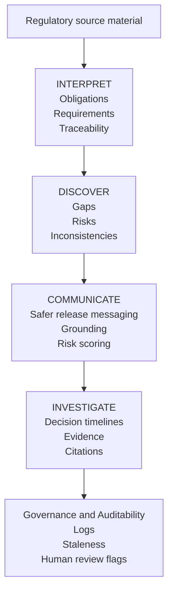

# AI Product Intelligence Suite 1.04

**Portfolio case study for AI product workflows in regulated enterprise software.**

Live demo: https://ai-app-intelligence-suite.streamlit.app/

This project is a portfolio case study, not a commercial product.

It is not a production enterprise platform.

It demonstrates how I design AI-assisted workflows that turn ambiguous compliance source material into reviewable, testable and audit-aware product decisions.

> Positioning: I design AI product workflows that turn ambiguous compliance inputs into auditable product decisions.

## Reviewer signal checklist

This portfolio case study demonstrates:

- domain understanding in regulated enterprise software;
- AI workflow design for product teams;
- human-in-the-loop review;
- risk-aware communication;
- evaluation discipline;
- enterprise readiness judgment;
- product strategy.

## What this project demonstrates

1. Domain understanding in regulated enterprise workflows.
2. AI workflow design beyond simple prompting.
3. Human-in-the-loop review and approval gates.
4. Risk-aware release communication.
5. Evaluation discipline and claim hygiene.
6. QA traceability, including mandatory negative test coverage.
7. Enterprise readiness judgment without claiming production completeness.
8. Hands-on execution with a working Streamlit prototype, services, tests and documentation.

## System flow

The suite demonstrates a product workflow from regulatory material to reviewed product artefacts, safer communication and audit-ready evidence.



## Hero workflow

The core case is **SAF-T PT / e-invoicing compliance-to-product traceability**:

```text
source document
→ extracted obligations
→ reviewer corrections
→ before/after requirement
→ Jira-style ticket
→ QA case
→ negative test coverage
→ risky release note
→ safer release note
→ incident if missed
→ final audit report
```

The goal is not to automate compliance decisions. The goal is to make product decisions more traceable, reviewable and measurable.

## Start here

If you are reviewing this project for hiring:

- [`PORTFOLIO_REVIEW_GUIDE.md`](PORTFOLIO_REVIEW_GUIDE.md) — 5-minute, 15-minute and 45-minute review paths.
- [`WHAT_THIS_DEMONSTRATES.md`](WHAT_THIS_DEMONSTRATES.md) — skills-to-evidence map.
- [`HERO_CASE_STUDY.md`](HERO_CASE_STUDY.md) — short hero case summary.
- [`DEMO_WALKTHROUGH_FOR_HIRING.md`](DEMO_WALKTHROUGH_FOR_HIRING.md) — 90-second demo walkthrough.
- [`PRODUCT_STRATEGY.md`](PRODUCT_STRATEGY.md) — ICP, personas, wedge, roadmap and metrics.
- [`VALIDATION_LIMITATIONS.md`](VALIDATION_LIMITATIONS.md) — what is validated, synthetic, local or not production-ready.
- [`docs/SYSTEM_OVERVIEW.md`](docs/SYSTEM_OVERVIEW.md) — system architecture, workflow and real-vs-simulated explanation.

## Key product capabilities

### Interpret — Compliance-to-Product Studio

Turns source material into obligations, source-linked evidence, reviewer decisions, requirement candidates, QA coverage and audit-aware exports.

### Discover — Product Discovery Studio

Converts a product idea into structured product artefacts such as assumptions, trade-offs, Jira-style tickets, Gherkin acceptance criteria, QA matrix and PRD completeness checks.

### Communicate — Release Readiness Copilot

Reviews release communication for risky claims and suggests safer wording with caveats, scope and approval boundaries.

### Investigate — Decision Timeline Builder

Builds incident and decision timelines with owners, severity, contradictions, risk register, postmortem actions and customer-escalation context.

## Quality and risk controls

Implemented as local portfolio controls:

- claim hygiene scanner;
- citation-support heuristics;
- mandatory negative test coverage;
- reviewer mode;
- approval workflow simulation;
- document hashes and versioning;
- run history and usage metrics;
- connector outbox payloads;
- real vs simulated capability table.

These are product judgment demonstrations, not claims of production SaaS readiness.

## Companion domains

The main hero case is SAF-T PT / e-invoicing.

Additional companion domains are included to show generalization thinking:

- Swiss QR-Bill / invoice payment compliance;
- SEPA / ISO 20022 structured-addresses companion playbook for a separate MIT agentic AI course project.

The payments playbook is intentionally kept outside the Streamlit workflow to preserve scope discipline.

## What is real vs simulated

Real local capabilities:

- Streamlit app;
- services and unit tests;
- local SQLite usage metrics;
- import/export flows;
- document hashing;
- local connector outbox payloads;
- claim hygiene scan;
- citation-support heuristics;
- QA negative coverage gate.

Not production-ready:

- production SSO;
- multi-tenant RBAC;
- encrypted tenant storage;
- immutable audit logs;
- full Jira/Slack/Confluence OAuth integrations;
- production observability;
- deployment hardening;
- legal/compliance approval.

## Run locally

```bash
python3 -m venv .venv
source .venv/bin/activate
python -m pip install --upgrade pip
python -m pip install -r requirements.txt
python -m pytest -q
python -m streamlit run app.py
```

Start with **Demo Mode ON** to avoid API usage.

## Responsible AI note

This project does not provide legal, compliance, tax, financial or regulatory advice. Human review is required before using any output in operational decisions.

## Release note

This repository was published as a consolidated public portfolio release. Earlier internal iterations were developed offline and are summarized in project documentation where relevant.
