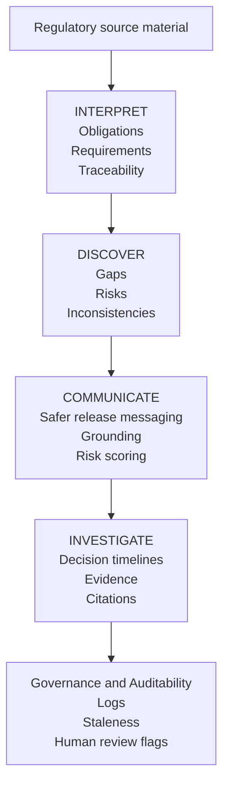

# AI Product Intelligence Suite 1.04

**Portfolio case study for AI product workflows in regulated enterprise software.**

[Live demo](https://ai-app-intelligence-suite.streamlit.app/) · [Release v1.04](https://github.com/MarKFigueiredo/ai-product-intelligence-suite/releases/tag/v1.04)


This project is a portfolio case study, not a commercial product.

In 60 seconds, this app shows how a regulated product team can convert ambiguous compliance input into reviewed requirements, QA coverage and safer release communication.

It demonstrates how I design AI product workflows for regulated enterprise software:

1. domain understanding;
2. AI workflow design;
3. human-in-the-loop review;
4. risk-aware communication;
5. evaluation discipline;
6. enterprise readiness judgment;
7. product strategy.

> Positioning: I design AI product workflows that turn ambiguous compliance inputs into auditable product decisions.

## 10-second summary

The suite shows how a compliance-sensitive product team could move from regulatory source material to reviewed requirements, QA coverage, safer release communication and audit-ready evidence.

It is intentionally human-in-the-loop. The goal is not to automate compliance decisions; the goal is to make product decisions more traceable, reviewable and measurable.

## What this is

- A working Streamlit portfolio prototype.
- A regulated-enterprise AI product workflow case study.
- A demonstration of product judgment, release risk thinking and evidence design.
- A local prototype with tests, services, docs, usage metrics and exports.

## What this is not

- Not a production SaaS platform.
- Not legal, tax, financial or regulatory advice.
- Not a replacement for compliance, legal, QA or product approval.
- Not a claim of enterprise deployment completeness.

## Visual walkthrough

| Start here / Hero Demo | Hero workflow output | QA, release and audit |
|---|---|---|
|  |  |  |

These screenshots show the intended first-click path: start with the hero demo, inspect the compliance-to-product output, then review QA, release-risk and audit evidence.

## 5-minute review path

1. Open the [live demo](https://ai-app-intelligence-suite.streamlit.app/).
2. Keep **Demo Mode ON**.
3. Review the hero workflow below.
4. Read [`HERO_CASE_STUDY.md`](HERO_CASE_STUDY.md).
5. Read [`WHAT_THIS_DEMONSTRATES.md`](WHAT_THIS_DEMONSTRATES.md).
6. Open [`docs/SYSTEM_OVERVIEW.md`](docs/SYSTEM_OVERVIEW.md) for architecture and real-vs-simulated scope.

## System flow



## Hero workflow

The core case is **SAF-T PT / e-invoicing compliance-to-product traceability**:

```text
source document
→ extracted obligations
→ reviewer corrections
→ before/after requirement
→ Jira-style ticket
→ QA case
→ negative test coverage
→ risky release note
→ safer release note
→ incident if missed
→ final audit report
```

This is intentionally deeper than a typical AI demo output. It shows how one compliance-sensitive input can propagate through product, QA, release communication and incident learning.

## Key product capabilities

### Interpret — Compliance-to-Product Studio

Turns source material into obligations, source-linked evidence, reviewer decisions, requirement candidates, QA coverage and audit-aware exports.

### Discover — Product Discovery Studio

Converts a product idea into structured product artefacts such as assumptions, trade-offs, Jira-style tickets, Gherkin acceptance criteria, QA matrix and PRD completeness checks.

### Communicate — Release Readiness Copilot

Reviews release communication for risky claims and suggests safer wording with caveats, scope and approval boundaries.

### Investigate — Decision Timeline Builder

Builds incident and decision timelines with owners, severity, contradictions, risk register, postmortem actions and customer-escalation context.

## Quality and risk controls

Implemented as local portfolio controls:

- claim hygiene scanner;
- citation-support heuristics;
- mandatory negative test coverage;
- reviewer mode;
- approval workflow simulation;
- document hashes and versioning;
- run history and usage metrics;
- connector outbox payloads;
- real vs simulated capability table.

These are product judgment demonstrations, not claims of production SaaS readiness.

## Useful review documents

- [`PORTFOLIO_REVIEW_GUIDE.md`](PORTFOLIO_REVIEW_GUIDE.md) — 5-minute, 15-minute and 45-minute review paths.
- [`WHAT_THIS_DEMONSTRATES.md`](WHAT_THIS_DEMONSTRATES.md) — skills-to-evidence map.
- [`PRODUCT_STRATEGY.md`](PRODUCT_STRATEGY.md) — ICP, personas, wedge, roadmap and metrics.
- [`VALIDATION_LIMITATIONS.md`](VALIDATION_LIMITATIONS.md) — what is validated, synthetic, local or not production-ready.
- [`docs/SYSTEM_OVERVIEW.md`](docs/SYSTEM_OVERVIEW.md) — architecture, workflow and real-vs-simulated explanation.
- [`docs/UI_UX_REVIEW.md`](docs/UI_UX_REVIEW.md) — public UI/UX review criteria.
- [`docs/CLAIM_HYGIENE_SCANNER.md`](docs/CLAIM_HYGIENE_SCANNER.md) — release-claim risk and safer wording control.

## Companion domains

The main hero case is SAF-T PT / e-invoicing.

Additional companion domains show generalization thinking:

- Swiss QR-Bill / invoice payment compliance;
- SEPA / ISO 20022 structured-addresses companion playbook for a separate MIT agentic AI course project.

The payments playbook is intentionally kept outside the main Streamlit workflow to preserve scope discipline.

## Run locally

```bash
python3 -m venv .venv
source .venv/bin/activate
python -m pip install --upgrade pip
python -m pip install -r requirements.txt
python -m pytest -q
python -m streamlit run app.py
```

Start with **Demo Mode ON** to avoid API usage.

## Responsible AI note

This project does not provide legal, compliance, tax, financial or regulatory advice. Human review is required before using any output in operational decisions.

## Release note

This repository was published as a sanitized consolidated public portfolio release. Earlier internal iterations were developed offline and are kept outside the public repository.
