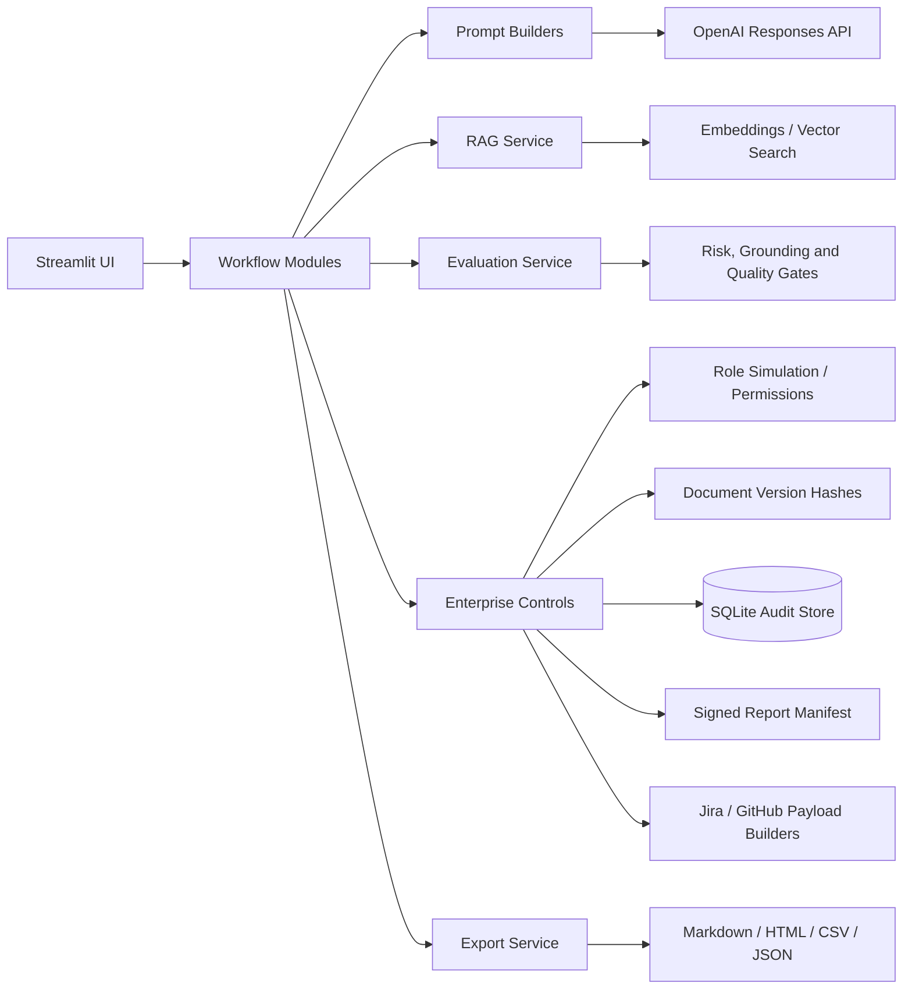

# Architecture

The suite is intentionally modular so the project looks like a maintainable product prototype rather than a single prompt demo.

## Design choices

- `modules/` owns workflow-specific UI and product logic.
- `services/` owns reusable capabilities such as model calls, RAG, citation support checking, exports, cost estimates, evaluation and enterprise controls.
- `prompts/` keeps model instructions separate from UI code.
- `ui/` owns reusable visual components and portfolio pages.
- `sample_inputs/` provides safe synthetic demos for public deployment.
- `benchmark/` contains reproducible synthetic evaluation fixtures and outputs.

## v16 enterprise-control slice

The package now implements a small real local control surface instead of only documenting roadmap items:

| Control | Implementation |
|---|---|
| Role simulation | Sidebar demo user + role selector. |
| Permission checks | `ROLE_PERMISSIONS` and `can(role, action)` in `services/enterprise_controls_service.py`. |
| Document versioning | SHA-256 document version records with metadata; source text not persisted by default. |
| Persistent audit | SQLite audit events with actor, role, action, workflow, document hash, output hash and signature. |
| Signed report | Demo HMAC manifest with document hash and report hash. |
| Integration realism | Jira/GitHub API-shaped mock payload builders. |

## Why this matters

A Principal PM or Series C reviewer should be able to see product thinking, responsible-AI controls and a path from prototype to enterprise workflow. v16 makes that path more credible by pairing the product narrative with implemented local controls and tests.
