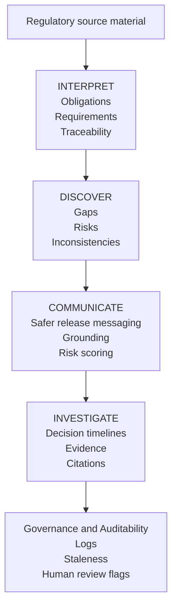

# System Overview

AI Product Intelligence Suite 1.04 is a portfolio case study showing how AI-assisted product workflows can support regulated enterprise software teams.

It is not a commercial product and not a production enterprise platform.

The system demonstrates how ambiguous compliance source material can be converted into structured, reviewable and testable product artefacts.

## Text diagram

```text
                ┌──────────────────────────┐
                │ Regulatory source material│
                └──────────────┬───────────┘
                               │
                               ▼
                    ┌────────────────────┐
                    │     INTERPRET      │
                    │ - Obligations      │
                    │ - Requirements     │
                    │ - Traceability     │
                    └─────────┬──────────┘
                              │
                              ▼
                    ┌────────────────────┐
                    │      DISCOVER      │
                    │ - Gaps             │
                    │ - Risks            │
                    │ - Inconsistencies  │
                    └─────────┬──────────┘
                              │
                              ▼
                    ┌────────────────────┐
                    │    COMMUNICATE     │
                    │ - Safer messaging  │
                    │ - Grounding        │
                    │ - Risk scoring     │
                    └─────────┬──────────┘
                              │
                              ▼
                    ┌────────────────────┐
                    │    INVESTIGATE     │
                    │ - Timelines        │
                    │ - Evidence         │
                    │ - Citations        │
                    └─────────┬──────────┘
                              │
                              ▼
                ┌────────────────────────────┐
                │ Governance and Auditability │
                │ - Logs                      │
                │ - Staleness                 │
                │ - Human review flags        │
                └────────────────────────────┘
```

## Mermaid diagram



## Core product flow

The main workflow is:

```text
source material
→ obligation extraction
→ source-linked evidence
→ reviewer decision
→ requirement candidate
→ Jira-style ticket
→ QA test case
→ negative test coverage
→ safer release communication
→ audit-ready export
```

The goal is not to replace compliance, legal, QA or product judgment. The goal is to make decisions more traceable and easier to review.

## Main modules

### Interpret — Compliance-to-Product Studio

This module turns regulatory or compliance-style source material into structured product outputs:

- obligations;
- evidence snippets;
- reviewer decisions;
- requirement candidates;
- QA cases;
- release-note risks;
- audit-ready export packages.

### Discover — Product Discovery Studio

This module helps convert a product idea into product-management artefacts:

- assumptions;
- user stories;
- Jira-style tickets;
- Gherkin acceptance criteria;
- QA matrix;
- PRD completeness checks.

### Communicate — Release Readiness Copilot

This module reviews product or release communication for risky claims and suggests safer wording.

It focuses on:

- claim hygiene;
- scope boundaries;
- caveats;
- approval awareness;
- safer release notes.

### Investigate — Decision Timeline Builder

This module creates structured incident and decision timelines.

It demonstrates how product teams can reason about:

- owner;
- severity;
- decision points;
- contradictions;
- customer impact;
- risk register;
- follow-up actions.

## Review and approval model

The system is intentionally human-in-the-loop.

AI-generated or AI-assisted outputs should be reviewed before being treated as product decisions.

The portfolio demonstrates:

- reviewer mode;
- approval workflow simulation;
- before/after corrections;
- evidence traceability;
- release gates.

## Quality controls

The project includes local controls that demonstrate product-quality thinking:

- claim hygiene scanner;
- citation-support heuristics;
- mandatory negative test coverage;
- document hashes;
- local run history;
- local SQLite usage metrics;
- import/export flows;
- connector outbox payloads;
- real vs simulated capability table.

These controls are demonstrations of product judgment, not production compliance guarantees.

## Real vs simulated capabilities

### Real local capabilities

The repository includes:

- Streamlit application;
- Python services;
- unit tests;
- local SQLite metrics;
- local exports;
- document hashing;
- claim hygiene scanning;
- citation-support heuristics;
- QA coverage checks.

### Simulated or portfolio-only capabilities

The project does not claim to provide:

- production SSO;
- enterprise RBAC;
- encrypted tenant storage;
- immutable audit logging;
- live Jira, Slack or Confluence OAuth integrations;
- production observability;
- legal/compliance approval;
- production deployment hardening.

## AI usage

The application can be used in demo/local mode for portfolio review.

Some flows may use deterministic local logic, especially for demonstration, QA, exports and release-gate checks.

When connected to an AI provider, AI should be treated as an assistant that drafts, structures and highlights risk — not as an autonomous decision-maker.

## Companion domains

The main hero domain is SAF-T PT / e-invoicing compliance.

Additional companion material shows how the same product-thinking pattern could apply to:

- Swiss QR-Bill invoice-payment compliance;
- SEPA / ISO 20022 structured-address payment compliance.

The companion payments playbook is intentionally kept outside the main Streamlit workflow to preserve scope discipline.

## Design principle

The system is positioned as a product-management portfolio artefact.

It is designed to demonstrate:

- AI workflow design;
- regulated-domain judgment;
- enterprise-readiness thinking;
- evaluation discipline;
- human review;
- scope control.

It should not be interpreted as legal, tax, financial or regulatory advice.
